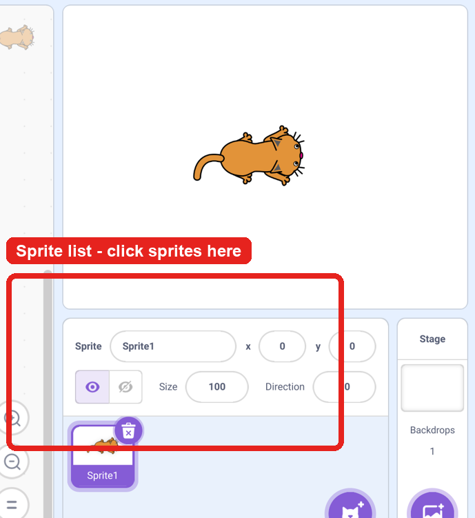

# Scratch Arcade Quest

Build a bright, fast little Scratch platform game over four lessons. The style is inspired by classic 16-bit arcade platformers: a hero runs, jumps, grabs coins, dodges enemies, and reaches a flag at the end of the level.

Each lesson is designed for independent work. Start at Lesson 1 and continue to work through the lessons.

!!! info "Arcade Quest update — 27 August 2026"
    The instructions and code pictures have been improved after pupil testing.

    - The player now starts safely on screen.
    - Left and right movement now keeps the player upright.
    - Jumping and gravity have been corrected so the player falls back down.
    - Coins must be separate sprites, not drawings on the backdrop.
    - Completed coin sprites can be duplicated to make several working collectables.

    If you have already started Arcade Quest, check your project against **Tasks 4, 5, and 7–12** before continuing.

!!! info "Arcade Quest update — 28 August 2026"
    Platforms are now made as a sprite instead of being painted on the backdrop.

    - The ground and floating platforms belong in one `Platforms` sprite.
    - The player now lands by detecting the `Platforms` sprite while falling.
    - Platform colour sensing is no longer needed.

    If you have already drawn platforms on the backdrop, follow **Task 2** to move them into a `Platforms` sprite, then replace the player code using **Task 5**.

## What You Will Make

By the end, your game will include:

- A controllable hero sprite.
- Platforms and jump physics.
- Coins, score, and sound effects.
- Enemies, lives, and a game over moment.
- A finish flag, timer, and win screen.

## What You Need

- Scratch open in the desktop app.
- A new project named `Arcade Quest`.
- A hero sprite, a platforms sprite, a coin sprite, an enemy sprite, and a flag sprite.
- A simple backdrop for the sky and scenery.

## How To Use The Code Images

Scratch code examples are shown as block images. Copy the blocks into Scratch one at a time.

## Where To Click Sprites

When a task says **In the sprite list below the Stage**, use the area in the red box.

{ .example-image }

Screenshot adapted from Wikimedia Commons, CC BY-SA 2.0.

## Start

[Start Lesson 1, Task 1: Draw Your Hero](tasks/01-draw-hero.md)
