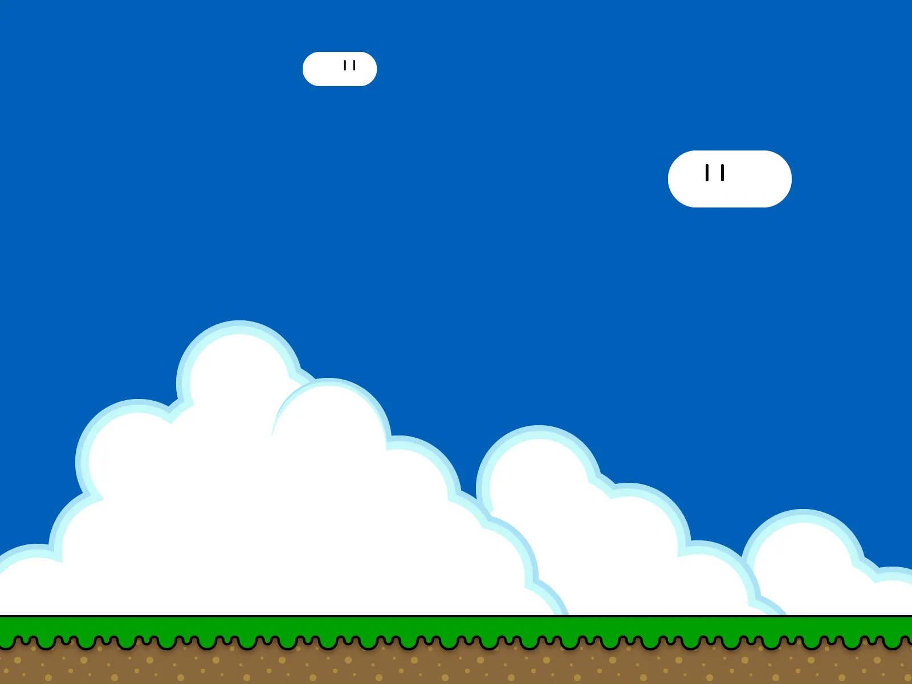

# Draw Your Level

## Goal

Draw the background scenery for your first level.

## Watch First

<iframe class="video-frame" src="https://www.youtube.com/embed/CQ4SldacxG4" title="YouTube video about drawing Scratch backdrops" allowfullscreen></iframe>

## Do This

1. Click the **Stage** and then click **Backdrops**.
2. Choose a colour for the sky.
3. Draw scenery such as clouds, hills, trees or buildings.
4. Leave space for the player and platforms.

!!! warning "Scenery only"
    The backdrop can include the ground, but do not add floating platforms or collectables. You will create those as sprites on the next pages.

{ .example-image }

## Check

The backdrop should contain the sky, scenery and ground, with no floating platforms or collectables painted onto it.
