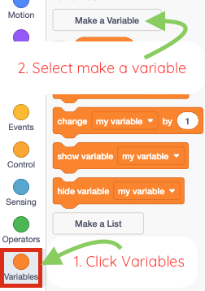

# Make `y speed` { .arcade-task }

## Goal

Create the variable that controls jumping and falling.

## Do This

1. In the sprite list below the Stage, click the `Player` sprite. (If you cannot remember where the sprite list is, go back to [Scratch Help: Where To Click Sprites](../scratch-help.md#where-to-click-sprites).)
2. Click **Variables**.
3. Click **Make a Variable**.
4. Name the variable `y speed`.
5. Click **OK**.

{ .scratch-image }

## Check

You should see a variable called `y speed`.
