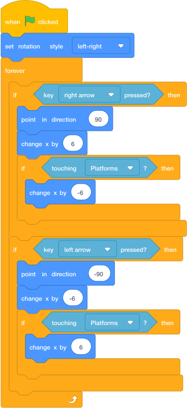

# Move Left And Right { .arcade-task }

## Goal

Make the player move with the arrow keys.

## Do This

1. In the sprite list below the Stage, click the `Player` sprite. (If you cannot remember where the sprite list is, go back to [Scratch Help: Where To Click Sprites](../scratch-help.md#where-to-click-sprites).)
2. Build this code.
3. Make sure `set rotation style` says **left-right**. This stops the player turning upside down.
4. Press the green flag.
5. Test the left and right arrow keys.

{ .scratch-image }

## Check

The player should move left and right and face the direction it is moving.
