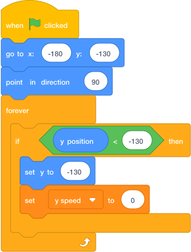
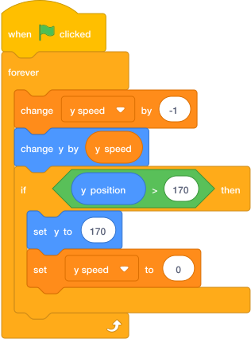
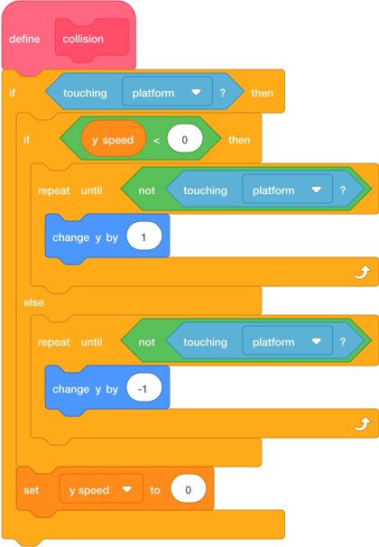
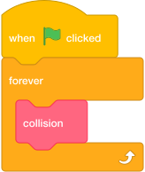
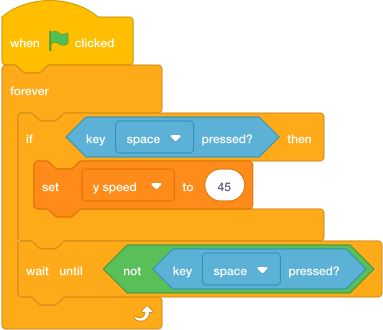

# Task 5: Jump And Fall

## Goal

Make the player jump, fall and stop on the platforms.

## Do This

1. Click the `Player` sprite.
2. Build each small script below.

### Start position

This puts the player back at the start if it falls below the level.

{ .scratch-image }

### Gravity

This pulls the player down. The extra check stops a large jump from leaving the top of the Stage.

{ .scratch-image }

### Collision

1. Click **My Blocks**.
2. Click **Make a Block**.
3. Name it `collision`.
4. Tick **Run without screen refresh**.
5. Click **OK**.
6. Put this code under `define collision`.

In each `touching` block, choose the sprite containing your platforms.

{ .scratch-image }

Now run the collision block continuously:

{ .scratch-image }

### Jump

This starts one jump for each press of the space bar.

{ .scratch-image }

Press the green flag, then tap **space**.

## Check

The player should:

- start at the left of the Stage;
- jump once when **space** is pressed;
- fall back down and stop on a platform;
- stay between the top and bottom of the Stage.
