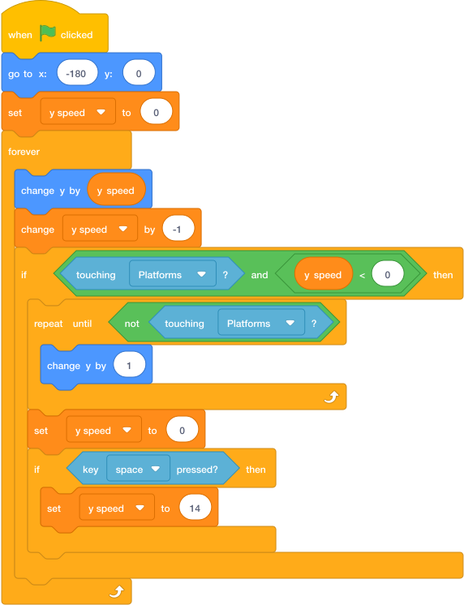

# Task 5: Jump And Fall

## Goal

Make the player jump and fall back down.

## Do This

1. In the sprite list below the Stage, click the `Player` sprite. (If you cannot remember where the sprite list is, go back to [Start Here: Where To Click Sprites](../../index.md#where-to-click-sprites).)
2. Build this code.
3. In the touching block, choose the `Platforms` sprite.
4. Check that the code tests whether `y speed` is less than `0`. The player should only land while falling.
5. Check that the space-key test is **inside** the platform-touching block. This prevents jumping in the air.
6. Press the green flag. The player should start at `x: -180`, `y: 0` and fall onto the ground.
7. Tap **space** to jump.

{ .scratch-image }

## Check

The player should start on screen, jump, fall, and stop on the `Platforms` sprite. Holding **space** must not make the player fly upwards.
