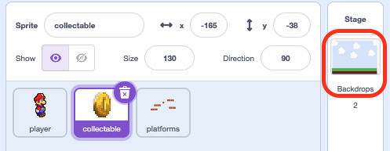
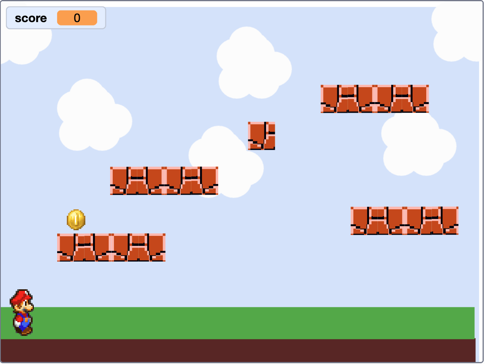

# Add The Scoring { .arcade-task }

## Goal

Create one shared score and make it start at zero each time the game starts.

## Add The Scoring

1. Click the first `Collectable` thumbnail in the sprite list below the Stage.
2. Click **Variables**, then **Make a Variable**.
3. Name the variable `score`.
4. Choose **For all sprites** so every collectable adds to the same score.
5. Click **OK**. Tick the box beside `score` to show the total on the Stage.

{ .scratch-image }

## Reset The Scoring

1. Click the **Stage** thumbnail beside the sprite list.

    { .example-image }

2. Click **Code**. From **Events**, drag out `when green flag clicked`.

    { .example-image }

3. From **Variables**, attach `set score to 0`. Choose `score` from the dropdown.

{ .scratch-image }

In the next task, the collectable will add points to the shared score.

## Check

You should see `score` on the Stage. Press the green flag and check that it shows `0`.

{ .example-image }
