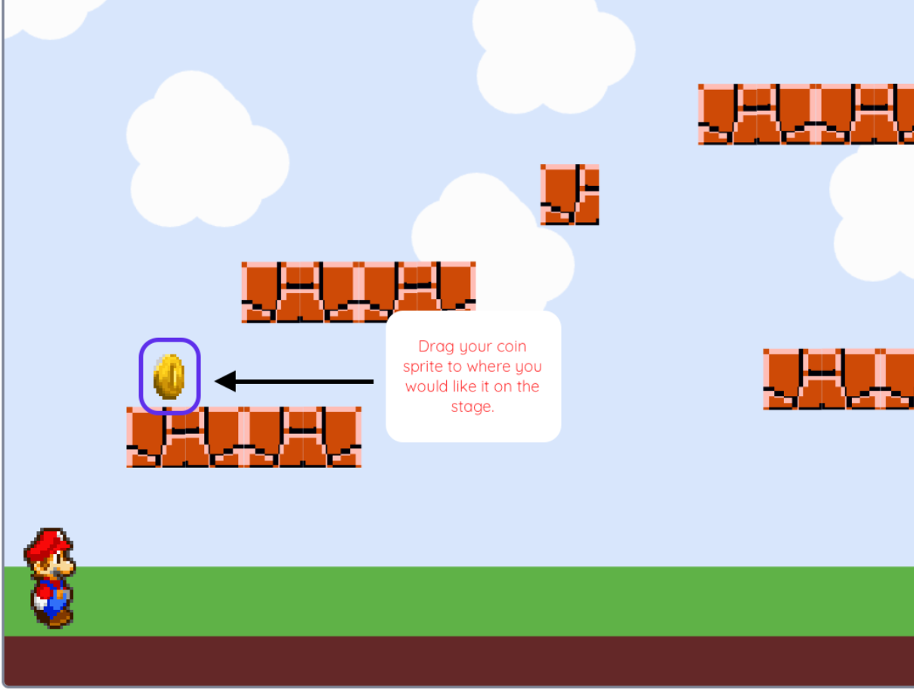
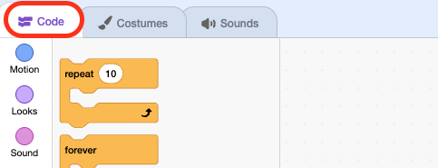

# Choose And Save The Collectable's Position { .arcade-task }

## Goal

Choose a place for your first collectable and make it return there whenever the game starts.

## Do This

1. Click the `Collectable` thumbnail below the Stage.

    { .example-image }

2. Find the collectable on the **Stage**—the game screen in the top-right of Scratch. Click and hold the collectable on the game screen, drag it just above a platform, then release the mouse button. Drag the collectable on the Stage, not its thumbnail in the sprite list.

    { .example-image }

3. Find the **x** and **y** number boxes in the sprite information panel, between the Stage and the sprite list. Write down both numbers.

    { .example-image }

4. Click **Code**.

    { .example-image }

5. Click **Events** and drag `when green flag clicked` into the code area.
6. From **Motion**, attach `go to x: y:` underneath it. Type your two numbers into it.
7. From **Looks**, attach `show`.

{ .scratch-image }

Use your own coordinates. If you already have this script, update it instead of adding another copy.

Keep **one collectable** for now. Finish its collection code and sound before duplicating it.

## Check

Drag the collectable to a different place on the **Stage**, then press the green flag. It should return to your chosen position and be visible.

Keep this script. Next, you will create the shared score and set it to zero. After that, you will add the collection blocks underneath this script.
