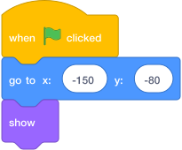
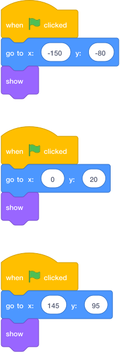

# Task 10: Place Your Coins

## Goal

Put a coin above a platform where the `Player` can reach it. Then learn how to add more coins without drawing each one again.

## Place The First Coin

1. In the sprite list below the Stage, click the `Coin` sprite.
2. Drag the coin on the Stage and place it just above a platform.
3. Choose a platform the `Player` can jump onto.
4. Leave a small gap between the coin and the platform. Do not put the coin inside the platform or the ground.
5. Press the green flag and test the jump.

## Make The Coin Return To Its Place

Add these blocks to the `Coin` sprite so it returns to the same place whenever the game starts:

{ .scratch-image }

Build it like this:

1. With the `Coin` sprite selected, open **Events** and add `when green flag clicked`.
2. Open **Motion** and attach `go to x: () y: ()`.
3. Open **Looks** and attach `show`.
4. Drag the coin to the place you want.
5. Look below the Stage to find the coin's current `x` and `y` numbers. Type those numbers into the `go to x: () y: ()` block.
6. Move the coin somewhere else, press the green flag, and check that it returns to its starting place.

The numbers above are only an example. Use the coordinates that fit your level.

## Add More Than One Coin

Wait until you have completed Tasks 11 and 12. The first coin will then have all its code and sound, so duplicating it copies everything.

1. Finish the first coin, including its code.
2. In the sprite list, right-click the `Coin` sprite. On a tablet, press and hold it.
3. Choose **duplicate**.
4. Select the new copy and drag it above a different reachable platform.
5. If you used starting-position code, change the `x` and `y` values in the copy so they match its new position.
6. Repeat **duplicate**, move, and update the coordinates for every extra coin.

Each sprite needs different coordinates. Here are three example starting-position scripts. Put the first script on `Coin`, the second on `Coin2`, and the third on `Coin3`:

{ .scratch-image }

Use your own `x` and `y` numbers—the examples will not fit every level.

Each coin must be a separate sprite. Do not paint several coins in one costume or onto the backdrop: Scratch would treat them as one object.

!!! warning "Do not duplicate the coin yet"
    Code added to `Coin` in the next tasks will not automatically appear in copies you make now. Finish Task 12 first, then return here and follow **Add More Than One Coin**.

## Check

- The first coin is visible and reachable.
- Every extra coin is a separate sprite in the sprite list.
- No coin is inside a platform or the ground.
- Pressing the green flag returns every coded coin to its own starting position.
