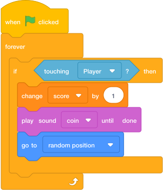

# Task 11: Collect Coins

## Goal

Make the coin increase the score when the player touches it.

## Do This

1. In the sprite list below the Stage, click the `Coin` sprite. (If you cannot remember where the sprite list is, go back to [Start Here: Where To Click Sprites](../../index.md#where-to-click-sprites).)
2. Build this code.
3. Press the green flag.
4. Move the player into the coin.

{ .scratch-image }

## Check

The score should go up by `1`, and the coin should move to a new place.
