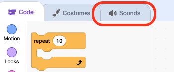
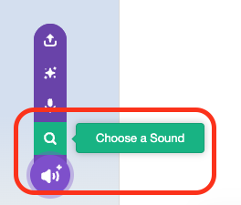
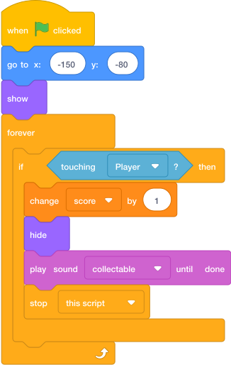

# Add Collectable Sound { .arcade-task }

## Goal

Finish the first collectable by adding a collection sound.

## Do This

1. Click the `Collectable` sprite.

    { .example-image }

2. Click **Sounds**.

    { .example-image }

3. Click **Choose a Sound** and choose a short sound.

    { .example-image }

4. Rename the sound `collectable` in the sound name box so it matches the code picture.
5. Click **Code**. Find the collection script you have already built.
6. From **Sound**, drag `play sound collectable until done` between `hide` and `stop this script`.

This is the **complete first collectable script**. Update your existing script to match; keep your own starting coordinates.

{ .scratch-image }

The `set score to 0` script stays on the **Stage**. The collectable only adds points to that shared score.

## Check Before Duplicating

1. Press the green flag: the collectable appears in its saved position and the score is `0`.
2. Drag `Player` onto the collectable and release it: the collectable hides, the sound plays, and the score becomes `1`.
3. Wait for the sound to finish: the score must stay at `1`.
4. Press the green flag again: the collectable returns and the score resets.

Once all four checks pass, use **Next** to duplicate the completed collectable. Its position code, touching check, scoring, and sound will all be copied.
