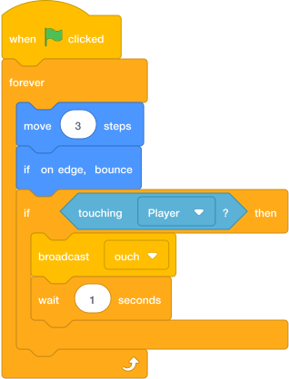

# Enemy Patrol { .arcade-task }

## Goal

Make the enemy move back and forth.

## Do This

1. In the sprite list below the Stage, click the `Enemy` sprite. (If you cannot remember where the sprite list is, go back to [Scratch Help: Where To Click Sprites](../scratch-help.md#where-to-click-sprites).)
2. Build this code.
3. Press the green flag.

{ .scratch-image }

## Check

The enemy should move and bounce when it reaches an edge.
