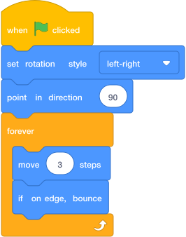

# Enemy Patrol { .arcade-task }

## Goal

Make the enemy move back and forth.

## Do This

1. In the sprite list below the Stage, click the `Enemy` sprite. (If you cannot remember where the sprite list is, go back to [Scratch Help: Where To Click Sprites](../scratch-help.md#where-to-click-sprites).)
2. Build this code.
3. Press the green flag.

{ .scratch-image }

`point in direction 90` makes the enemy start by moving horizontally to the right. `set rotation style left-right` keeps it upright when it bounces and faces the other way.

## Check

The enemy should patrol horizontally from side to side and bounce when it reaches an edge. It should not drift up or down.
