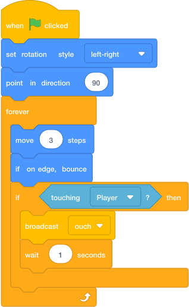

# Send `ouch` { .arcade-task }

## Goal

Make the enemy send a message when it touches the player.

## Do This

1. In the sprite list below the Stage, click the `Enemy` sprite. (If you cannot remember where the sprite list is, go back to [Scratch Help: Where To Click Sprites](../scratch-help.md#where-to-click-sprites).)
2. Add the `if touching Player then` block to the enemy patrol code as shown.
3. From **Events**, drag `broadcast message1` inside the `if` block.
4. Open its menu, choose **New message**, and name it `ouch`.
5. Add `wait 1 seconds` below the broadcast. This prevents one collision from sending the message many times immediately.

{ .scratch-image }

`broadcast ouch` sends a message to the other sprites; it does not display the word “ouch” or cause a visible change by itself. In the next task, you will add code to the `Player` that receives this message and removes a life.

## Check

The enemy patrol should contain the `touching Player` check, `broadcast ouch`, and the wait block. It is normal for touching the enemy to have no visible effect until you complete **Lose A Life**.
