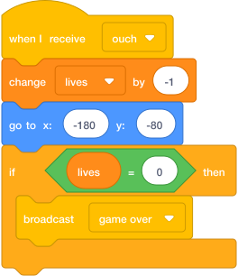

# Lose A Life { .arcade-task }

## Goal

Make the player lose one life after touching an enemy.

## Do This

1. In the sprite list below the Stage, click the `Player` sprite. (If you cannot remember where the sprite list is, go back to [Scratch Help: Where To Click Sprites](../scratch-help.md#where-to-click-sprites).)
2. Build this code.
3. Test by touching the enemy.

{ .scratch-image }

## Check

The player should lose one life and return to the start.
