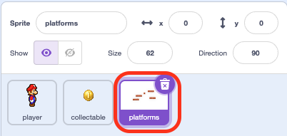
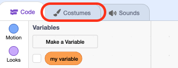
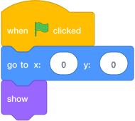
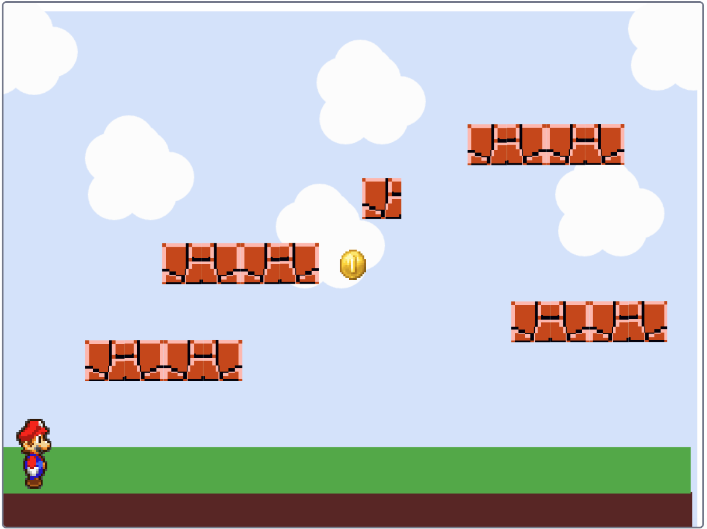

# Arrange Your Platforms { .arcade-task }

## Goal

Arrange multiple platforms to make a route through the level.

## Do This

Keep all your floating platforms in the same costume of the `Platforms` sprite so the player can detect them together.

1. Find the sprite list below the **Stage** (the area where your game appears). Click the thumbnail labelled `Platforms`.

    { .example-image }

2. Look at the sprite information panel between the Stage and the sprite list. Find the number boxes labelled **x** and **y**, near the sprite's name.

    { .example-image }

    The picture shows the player selected. For this task, click `Platforms` before changing the numbers.

3. Click inside the **x** box, select the existing number, type `0`, and press **Enter**.
4. Click inside the **y** box, select the existing number, type `0`, and press **Enter**. Both boxes should now show `0`. This places the centre of the whole `Platforms` sprite at the centre of the Stage.
5. Open **Costumes** and choose the **Select** tool.

    { .example-image }

6. Select one platform shape and drag it within the costume editor. Watch the Stage to see where it appears in the level.
7. Move the first platform near the player, a little above ground level.
8. Move the second platform farther right and a little higher. Leave a gap for jumping.
9. To add another platform, select a platform shape, copy and paste it, then move the new shape to another position in the **same costume**.
10. Leave clear space above each platform for the player and a collectable.

Dragging `Platforms` on the Stage moves all its platforms together. To move just one platform, select its shape in **Costumes**. Do not duplicate the whole sprite or create a new costume for each platform.

## Save The Platforms' Position

Add this code so the whole platform layout returns to the same position when the game starts.

1. Click the `Platforms` thumbnail in the sprite list below the Stage.

    { .example-image }

2. Click the **Code** tab.

    { .example-image }

3. Click **Events**. Drag `when green flag clicked` into the code area.
4. Click **Motion**. Drag `go to x: y:` underneath the green-flag block until they snap together. Enter `0` in both number boxes in this block.
5. Click **Looks**. Attach `show` underneath the `go to` block.

Your completed script should look like this:

{ .scratch-image }

The two zeros match the sprite position you set earlier. The individual platform shapes keep the positions you chose in **Costumes**.

## Check

- All floating platforms are shapes in one `Platforms` costume.
- The platforms form a route from the player, with gaps for jumping.

To test the starting-position code, drag a platform on the **Stage** (the game screen). All the platforms should move together. Press the green flag: the whole layout should return to its original position, with **x** and **y** both showing `0`.

You will test whether the jumps reach each platform in Part 6.

{ .example-image }
