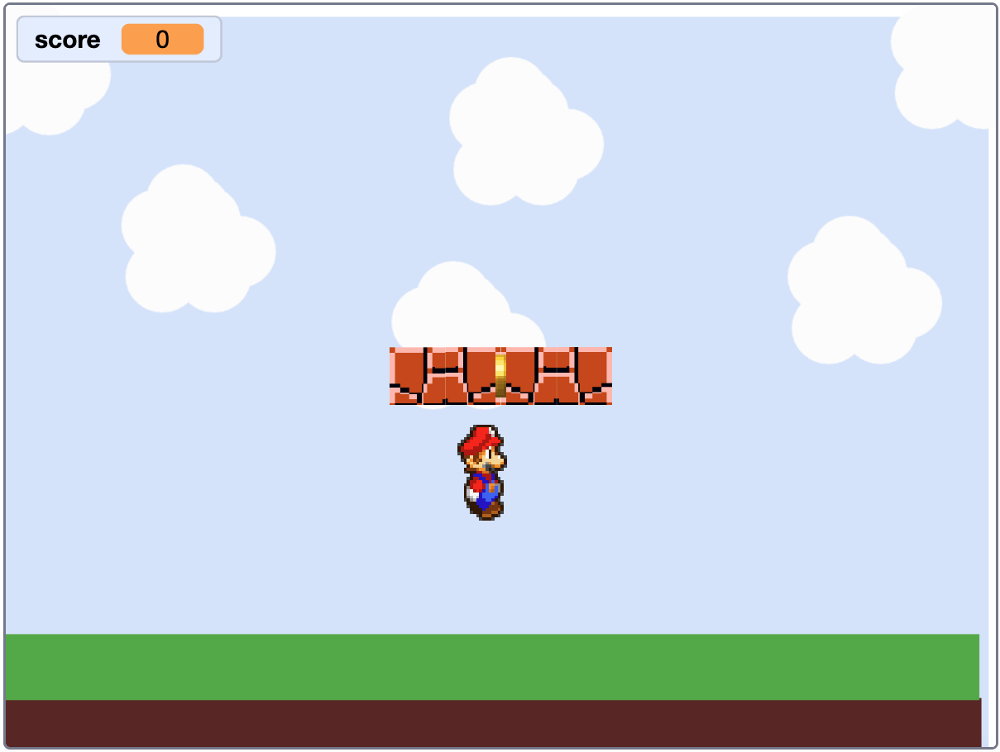

# Check Your Game World { .arcade-task }

Before starting Part 2, check that you have:

- A backdrop with sky, scenery, and ground.
- A `Player` sprite.
- A `Platforms` sprite with the floating platforms drawn in one costume.
- A `Collectable` sprite.

Compare your project with this example. Your artwork can be different. You will arrange the sprites and add their code in the next parts.

{ .example-image }

Use **Next** at the bottom of the page to start Part 2.
