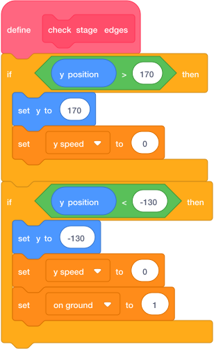

# Check Stage Edges { .arcade-task }

## Goal

Make a block that keeps the player between the top and bottom of the Stage.

## Do This

Select the `Player` sprite.

1. Click **My Blocks → Make a Block**.
2. Name it `check stage edges`.
3. Tick **Run without screen refresh**.
4. Click **OK**.
5. Build the script below.

{ .scratch-image }

The first check stops the player at the top of the Stage. The second stops them at ground level. `set on ground to 1` lets the player jump after landing on the ground.

## Check

Check the numbers: `170` for the top and `-130` for the bottom.

Keep your `collision` block. We will connect both blocks on the next page.

Next: [Move Vertically](move-vertically.md).
