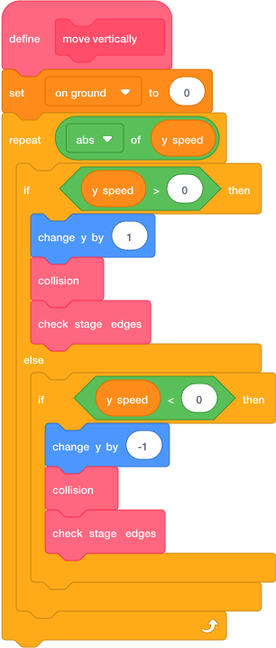

# Move Vertically { .arcade-task }

## Goal

Move in small steps so the player cannot skip through a thin platform.

## Do This

Select the `Player` sprite.

1. Click **My Blocks → Make a Block**.
2. Name it `move vertically`.
3. Tick **Run without screen refresh**, then click **OK**.
4. Build the script below. Use the pink blocks you made on the last two pages.
5. For `abs of`, use the green Operators block with the dropdown and select **abs**.

{ .scratch-image }

`abs` gives the number of steps. For example, a speed of `-5` means five steps down. The block checks for a collision after each step.

## Check

Check that both directions call `collision` and `check stage edges` after moving one pixel.

Your three custom blocks are ready. On the next page, you will build the gravity script that runs them.

Next: [Add Gravity](05-jump-gravity.md).
