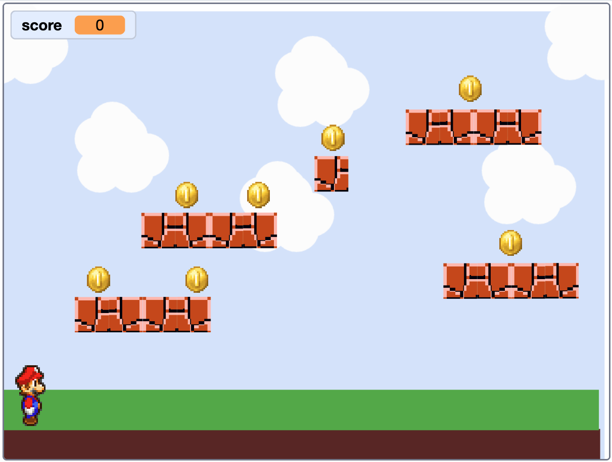

# Check Your Game World { .arcade-task }

Before starting Part 5, check that your sprite list contains separate `Player`, `Platforms` and `Collectable` sprites.

Check that the player is on the left, the platforms form a route, and the first collectable is above a platform. Press the green flag to check that the platforms and collectable return to their saved positions.

Drag the `Player` onto each collectable and release it. Each collectable should add one point, disappear, and play its sound. Press the green flag again: the score should reset to `0` and all collectables should reappear. You will add movement in Part 5 and jumping in Part 6.

{ .example-image }

When you are ready, use **Next** at the bottom of the page to start Part 5.
