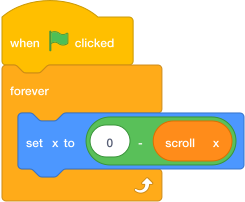

# Move The Level Sprites { .arcade-task }

## Goal

Make the platforms, collectables, enemy, and flag move using `scroll x`.

## Do This

Build this code on `Platform 1`.

1. In the sprite list below the Stage, click `Platform 1`. (If you cannot remember where the sprite list is, go back to [Scratch Help: Where To Click Sprites](../scratch-help.md#where-to-click-sprites).)
2. Build this code.

{ .scratch-image }

## Change The Number

The code image uses `0`.

For each sprite, change the `0` to the number below:

- `Platform 1`: use `0`
- `Platform 2`: use `240`
- `Platform 3`: use `480`
- Collectable: use `300`
- Enemy: use `520`
- Flag: use `700`

Build the same code on `Platform 2`, `Platform 3`, `Collectable`, `Enemy`, and `Flag`.

## Check

Each level sprite should have scrolling code with its own starting-position number. Press the arrow keys and check that the sprites move together.
