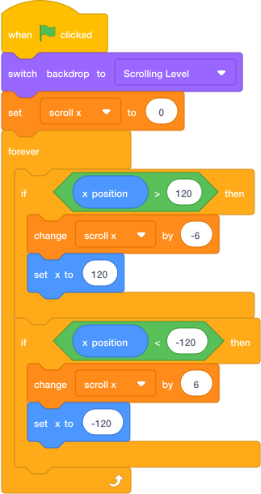

# Add Scrolling Controls { .arcade-task }

## Goal

Use the arrow keys to change the scrolling position.

## Do This

1. In the sprite list below the Stage, click the `Player` sprite.
2. Build this code.
3. Add `switch backdrop to Scrolling Level` under the green flag block.

{ .scratch-image }

## Check

Press the green flag. The `Scrolling Level` backdrop should appear and `scroll x` should reset to `0`. Press the arrow keys and check that `scroll x` changes. You will connect the level sprites to this variable in the next task.
