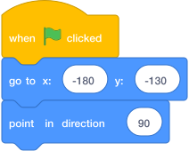
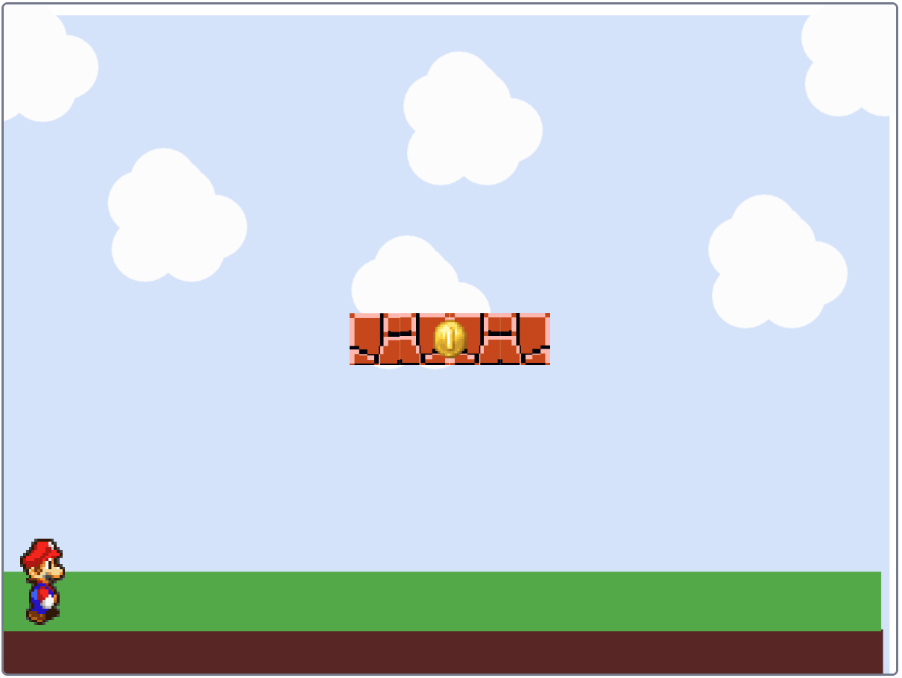

# Set Your Player's Start Position { .arcade-task }

## Goal

Set up the player's starting position and direction.

## Do This

This is the first coding step for your `Player` sprite.

1. Click the `Player` sprite in the sprite list below the Stage.
2. Check that the player is small enough to fit on your platforms. Adjust **Size** below the Stage if needed.
3. Build this code to place the player on the left at the start of the game.

{ .scratch-image }

When you click the green flag, the player starts at `x: -180`, `y: -130` and faces right.

Keep this script on the sprite as you add movement and jumping in the next steps.

In [Add Gravity](05-jump-gravity.md), you will add the ground check inside the gravity loop.

## Check

1. Press the green flag. The player should appear at the left of the Stage, facing right.
2. Move the player somewhere else, then press the green flag again. It should return to `x: -180`, `y: -130`.

{ .example-image }
