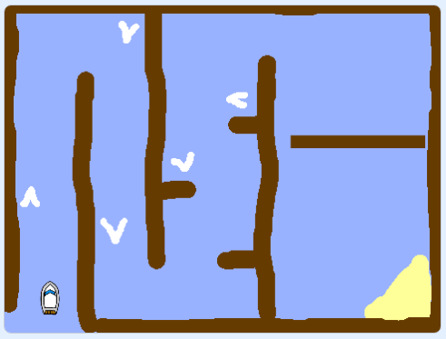

# Scratch Boat Race

Build a boat-racing game where you steer with the mouse, avoid wooden barriers, use boosters, and reach an island as quickly as possible.

## Get Started

1. Open Scratch desktop.
2. Use **Next** at the bottom of this page to open **Open The Starter Project**.
3. Download and open the starter file, then build and test your game one task at a time.

!!! tip "Work at your own pace"
    The project has six parts, followed by optional challenges. A part may take more than one class session. Complete and check each task before moving on. If you have already started, carry on from your last task using the navigation.

{ .example-image }

## Experiences and Outcomes

| Experience and Outcome | What you will do in Boat Race | Evidence of success |
| --- | --- | --- |
| **TCH 3-13a** — Information processes and how they communicate | Run the boat, Stage timer, and spinning gate scripts at the same time. Explore how `stop all` ends them together. | You can identify the separate processes and explain what happens to them when the player wins. |
| **TCH 3-14a** — Read and explain programming constructs | Build and trace scripts using events, loops, conditions, sensing, operators, and the `time` variable. | You can explain how the code controls movement, crashes, boosters, and timing. |
| **TCH 3-15a** — Design, build, evaluate, and refine a solution | Build the race from a starter project, test each feature, fix problems, and add an improvement. | Your game meets its requirements, and you can describe a change made after testing. |

!!! note "Assessment note"
    This project can contribute evidence towards these outcomes. It uses one variable, `time`; further work with multiple variables is needed to demonstrate that aspect of the Level 3 design-and-build benchmark. Be ready to explain your code and demonstrate your testing.

## Need Something Else?

- [Scratch Help](scratch-help.md): find sprites, read code images, and choose colours.
- [Project Updates](updates.md): find your place if you started the earlier six-step guide.

## Attribution

This project is adapted from the original [Boat race](https://github.com/RaspberryPiLearning/boat-race) learning resource published by the [Raspberry Pi Foundation](https://www.raspberrypi.org).

The original project is licensed under the [Creative Commons Attribution-ShareAlike 4.0 International License](https://creativecommons.org/licenses/by-sa/4.0/).
