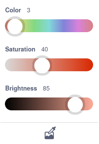
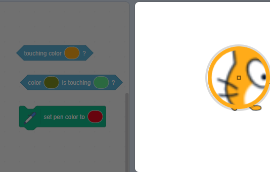

# Scratch Help

## How To Use The Code Images

Copy the blocks into Scratch one at a time. When an image shows a script you have already started, update that script. Keep the blocks from earlier tasks unless the instructions tell you to change them. Outlined sections show the new code to add.

Click a code image to enlarge it if the block text is difficult to read.

## Where To Click Sprites

The sprite list is below the Stage. Click the boat thumbnail to edit the boat, or the `gate` thumbnail to edit the gate. Click the **Stage** thumbnail beside the sprite list to work on the timer or backdrops.

{ .example-image }

{ .example-image }

## Choose A Colour From The Stage

1. Click the colour input in the `touching color` block.
2. Click the eyedropper at the bottom of the colour picker.
3. Move over the Stage and click the colour you need: brown wood, yellow island, or white booster.
4. Click in the Code area to close the picker.

{ .example-image }

{ .example-image }

## Save Your Work

Choose **File → Save to your computer**. Save your `.sb3` file somewhere you can find it again. To continue later, open Scratch and choose **File → Load from your computer**.
