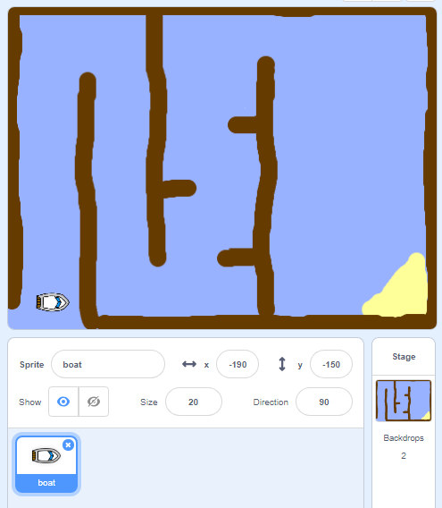

# Open The Starter Project { .boat-task }

## Goal

Open and save your own copy of Boat Race.

[Download the Boat Race starter project](../BoatRace.sb3){ .md-button .md-button--primary .download-button }

## Do This

1. Download the starter project using the button above.
2. Open Scratch desktop.
3. Choose **File → Load from your computer**.
4. Open your **Downloads** folder, select `BoatRace.sb3`, and click **Open**.
5. Choose **File → Save to your computer** and save your copy somewhere you can find it again.

{ .example-image }

## Check

The project opens with a boat and a race course. You have saved your own copy.
