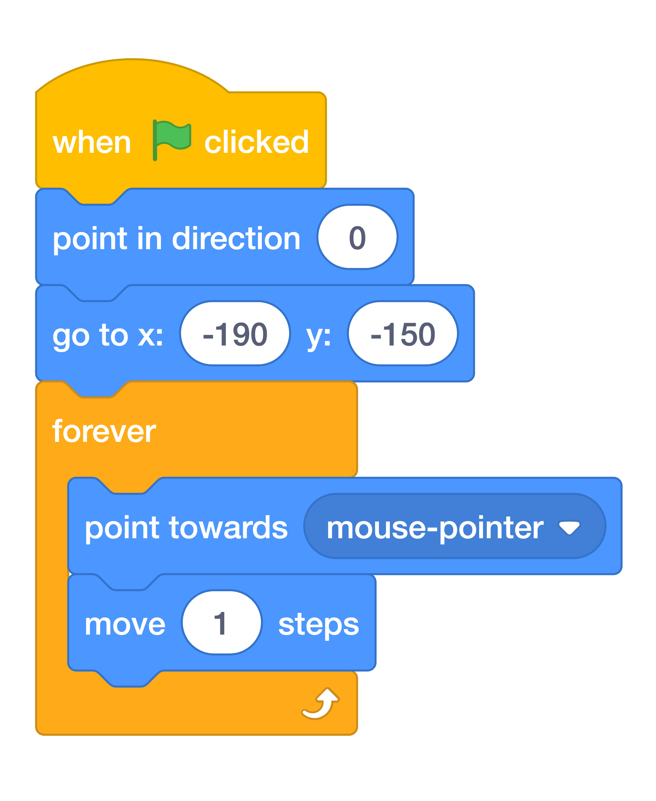

# Follow The Mouse { .boat-task }

## Goal

Make the boat start in the bottom left and follow the mouse.

## Watch First

<iframe class="video-frame" src="https://www.youtube.com/embed/k627g3swVgY" title="Controlling the boat" allowfullscreen></iframe>

## Do This

1. In the sprite list below the Stage, click the boat. Click **Code**.
2. Build the script in the image. Set the starting direction to `0` and the starting position to `x: -190`, `y: -150`.
3. Put `point towards mouse-pointer` and `move 1 steps` inside the `forever` loop.
4. Press the green flag and move the mouse around the water on the Stage.
5. Hold the mouse still and watch what happens when the boat reaches it.

{ .scratch-image }

{ .example-image }

## Check

The boat follows the pointer. It may wobble when it reaches the pointer; you will fix that in the next task.
