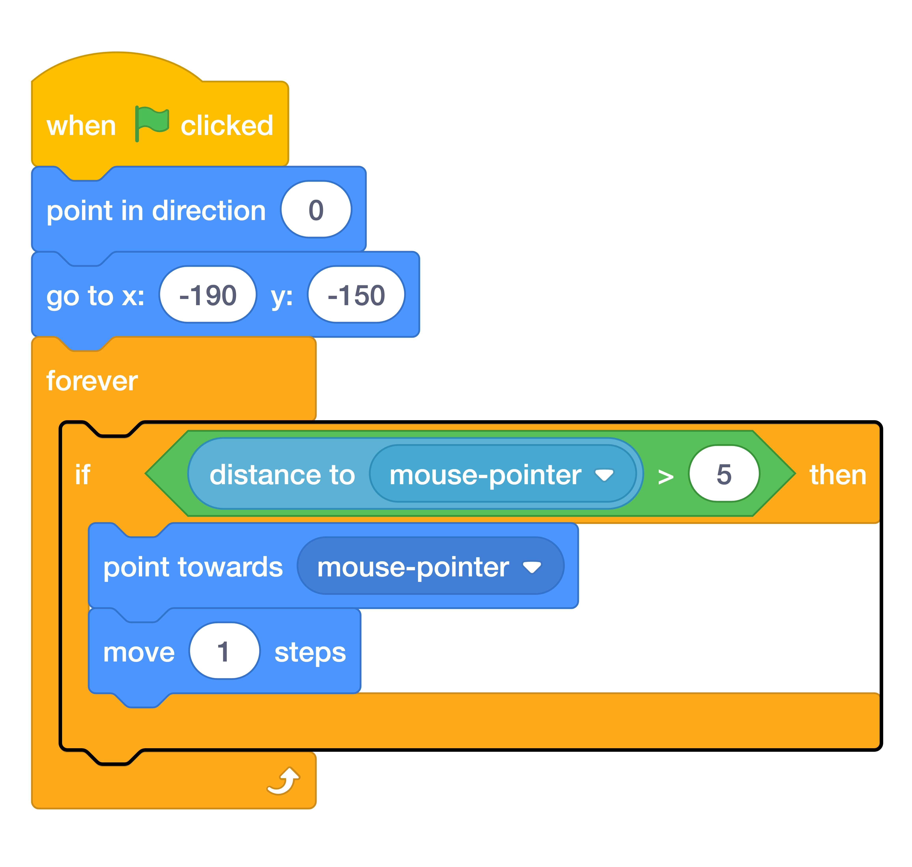

# Stop At The Pointer { .boat-task }

## Goal

Stop the boat moving when it is close to the mouse.

## Do This

1. Select the boat and find the movement script you just built.
2. Inside `forever`, wrap the two movement blocks in an `if then` block from **Control**.
3. From **Operators**, put a `>` block into the condition.
4. Put `distance to mouse-pointer` from **Sensing** on the left and `5` on the right.
5. Compare your updated script with the image. Update the existing script rather than building a second copy.
6. Press the green flag. Move the pointer, then hold it still.

{ .scratch-image }

## Check

The boat follows the mouse and settles when it gets close. Explain why the movement blocks only run when the distance is greater than `5`.
