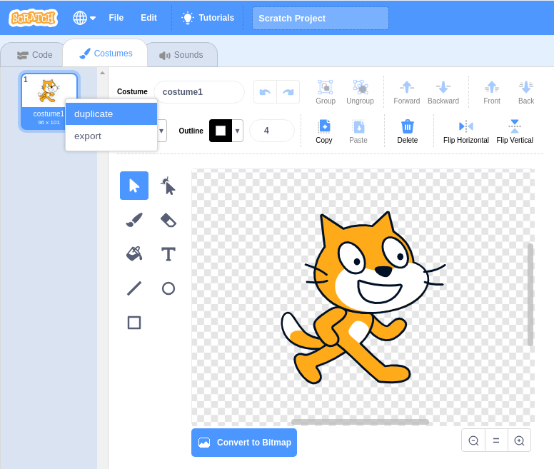
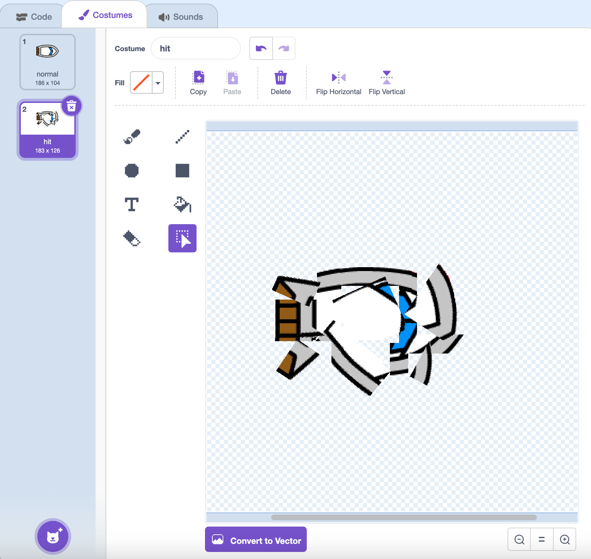

# Make A Hit Costume { .boat-task }

## Goal

Give the boat a second costume to show a crash.

## Do This

1. Select the boat and open the **Costumes** tab.
2. Rename the original boat costume `normal`.
3. Right-click its costume thumbnail and choose **duplicate**.
4. Rename the copy `hit`.
5. With `hit` selected, use the **Select** tool to move and rotate pieces so the boat looks broken. Keep the `normal` costume intact.

{ .example-image }

{ .example-image }

## Check

The boat has two costumes named exactly `normal` and `hit`. Click each thumbnail to check the difference.
