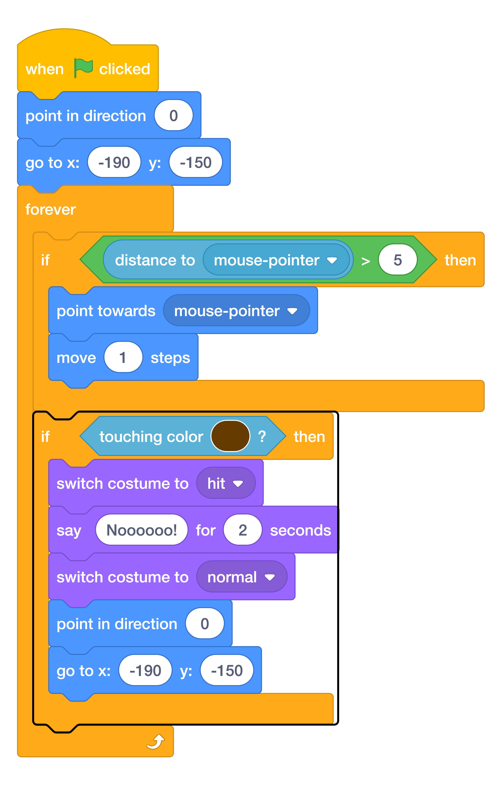
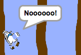

# Detect The Wooden Barriers { .boat-task }

## Goal

Make the boat crash and return to the start when it touches wood.

## Do This

1. Select the boat and click **Code**.
2. Add another `if then` inside the existing `forever`, below the mouse movement condition. Do not put it inside the distance check.
3. Use `touching color` from **Sensing** as the condition. Use the [eyedropper](../scratch-help.md#choose-a-colour-from-the-stage) to select brown from a wooden barrier.
4. Inside this new condition, add the costume, speech, direction, and position blocks shown in the outlined section of the image.
5. Set the reset position to `x: -190`, `y: -150` and direction to `0`.
6. Press the green flag and steer into a wooden barrier.

{ .scratch-image }

{ .example-image }

## Check

The boat switches to `hit`, shows a crash message for two seconds, then changes back to `normal` and returns to the start.
