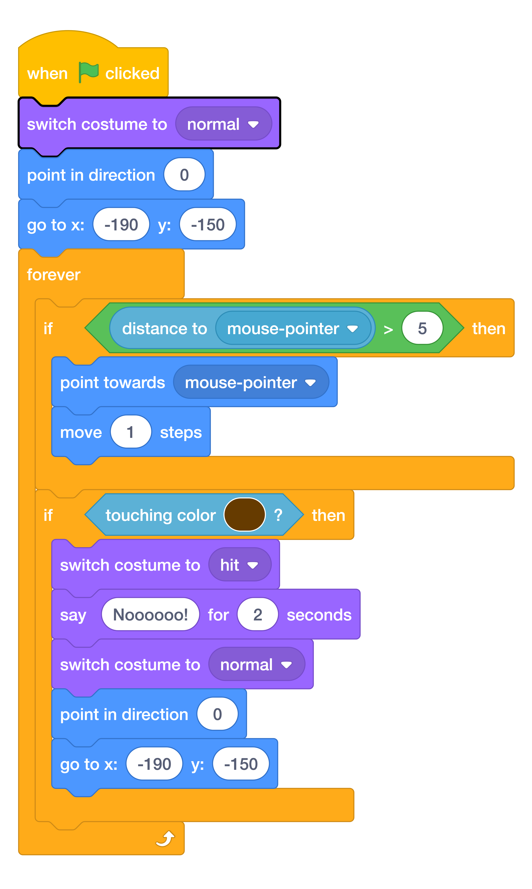

# Start With The Normal Costume { .boat-task }

## Goal

Make every new race start with an undamaged boat.

## Do This

1. Select the boat and find the top of its movement script.
2. Add `switch costume to normal` directly below `when green flag clicked`, before the direction and position blocks.
3. Keep all the movement and crash code below these starting blocks.
4. Open **Costumes** and select `hit`, then press the green flag.

{ .scratch-image }

## Check

The boat immediately changes to `normal` and starts from the bottom left, even if it was showing the hit costume before the race.
