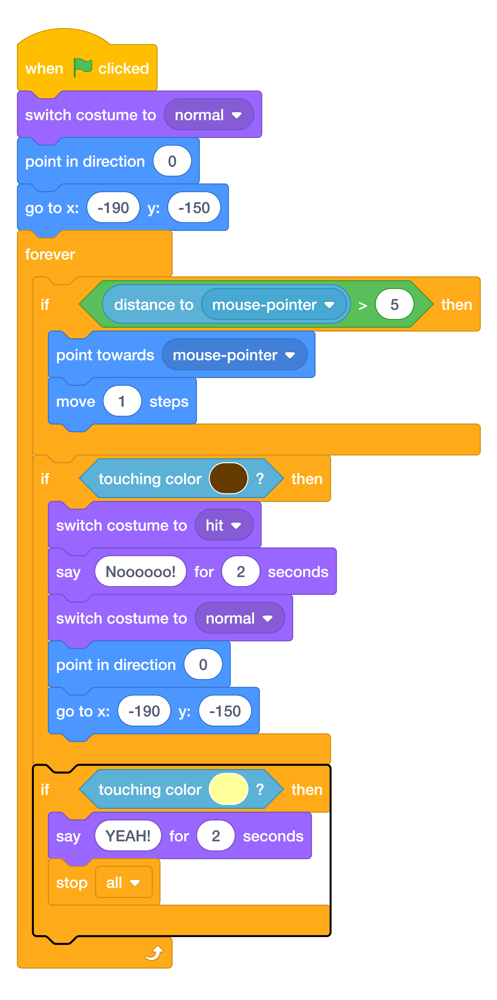

# Add The Winning Condition { .boat-task }

## Goal

End the race when the boat reaches the island.

## Do This

1. Select the boat and find its `forever` loop.
2. Add a new `if then` below the crash condition, still inside `forever`.
3. Put `touching color` in the condition. Use the [eyedropper](../scratch-help.md#choose-a-colour-from-the-stage) to select yellow from the island.
4. Inside this condition, add `say YEAH! for 2 seconds`, then `stop all`.
5. Check the dropdown on the stop block says **all**.
6. Compare your script with the image and sail to the island.

{ .scratch-image }

## Check

The boat says `YEAH!` for two seconds and then all scripts stop. The mouse no longer moves the boat.
