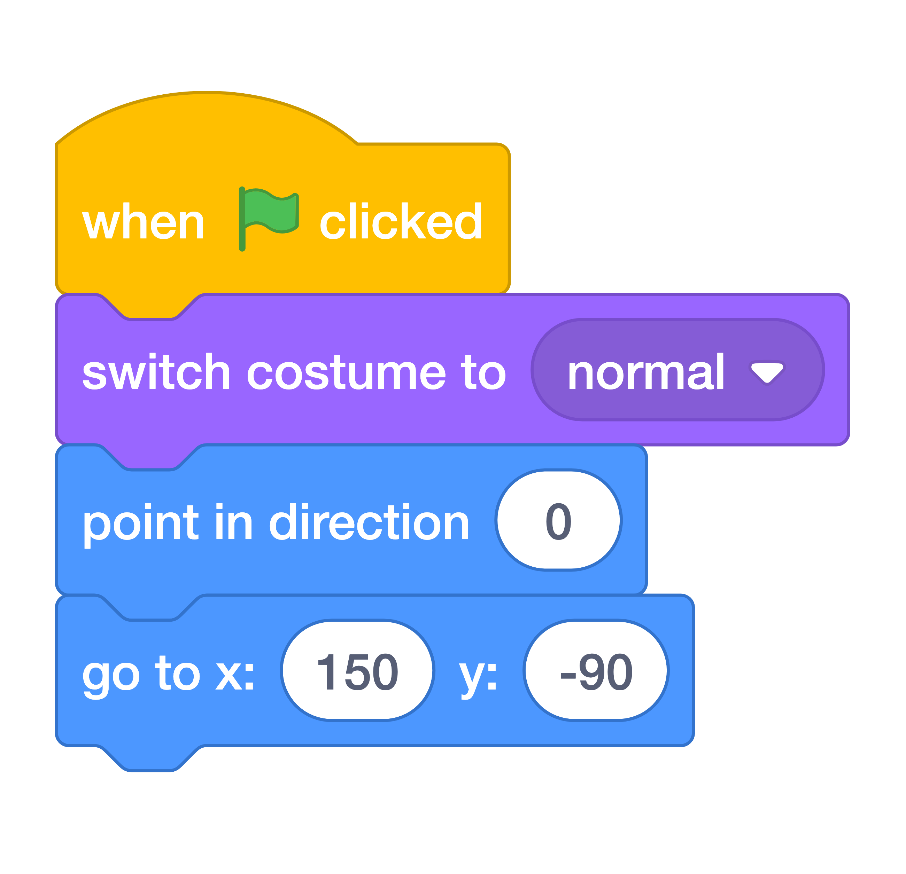

# Test Your Race { .boat-task }

## Goal

Check movement, crashes, winning, and restarting together.

## Do This

1. Press the green flag. Check that the boat starts at `x: -190`, `y: -150`.
2. Move the mouse, then hold it still. Check that the boat follows and settles near the pointer.
3. Touch a barrier. Check that the boat changes costume and returns to the start.
4. Reach the island. If testing is difficult, temporarily change only the first `go to` block to place the boat near the island, as shown below.
5. After testing, restore the first `go to` block to `x: -190`, `y: -150`. Leave the crash reset at the same starting position.
6. Press the green flag again and check that a new race begins. Save your project.

{ .scratch-image }

## Check

All four behaviours work: following, crashing, winning, and restarting. Fix any failed check before adding the timer.
