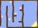
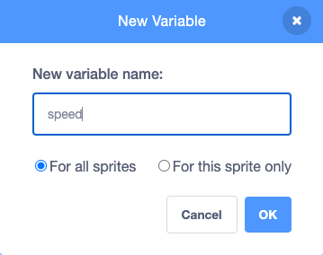
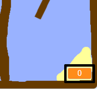

# Make time { .boat-task }

## Goal

Create a variable to display how long the race takes.

## Do This

1. Click the **Stage** thumbnail beside the sprite list, then click **Code**.
2. Click **Variables**, then **Make a Variable**.
3. Name it `time`. Create it for all sprites if Scratch offers that choice.
4. Click **OK** and tick the box beside `time` to show it on the Stage.

{ .example-image }

{ .example-image }

{ .example-image }

## Check

A variable named `time` is visible on the Stage. It does not count yet; you will add that code next.
