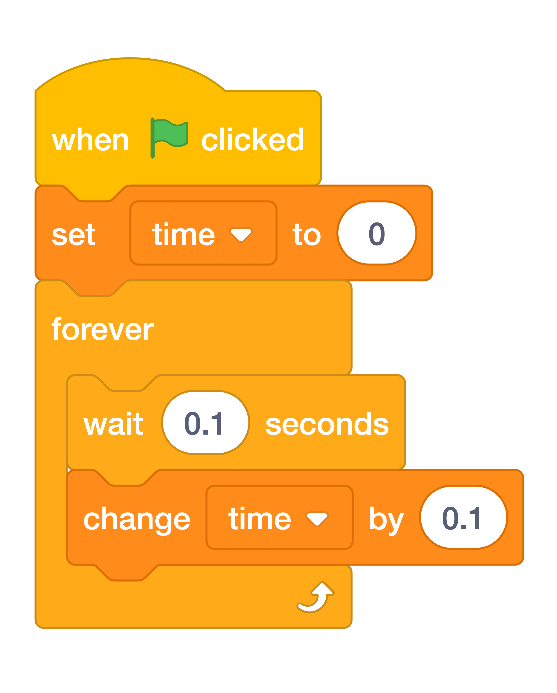

# Count Up { .boat-task }

## Goal

Reset the timer for each race and count in tenths of a second.

## Do This

1. Select the **Stage** and click **Code**.
2. Build the script in the image. Put `set time to 0` immediately below `when green flag clicked`.
3. Add a `forever` loop with `wait 0.1 seconds` followed by `change time by 0.1`.
4. Press the green flag and watch `time` increase while you steer.
5. Crash into a barrier. The timer should keep counting while the boat returns to the start.
6. Reach the island. The timer stops when `stop all` runs, after the two-second winning message.
7. Press the green flag again to check that `time` resets. Save your project.

{ .scratch-image }

{ .example-image }

## Check

The timer starts at zero, counts during the race, and stops when the game ends. You can explain how the Stage’s timer and the boat’s movement run at the same time.
