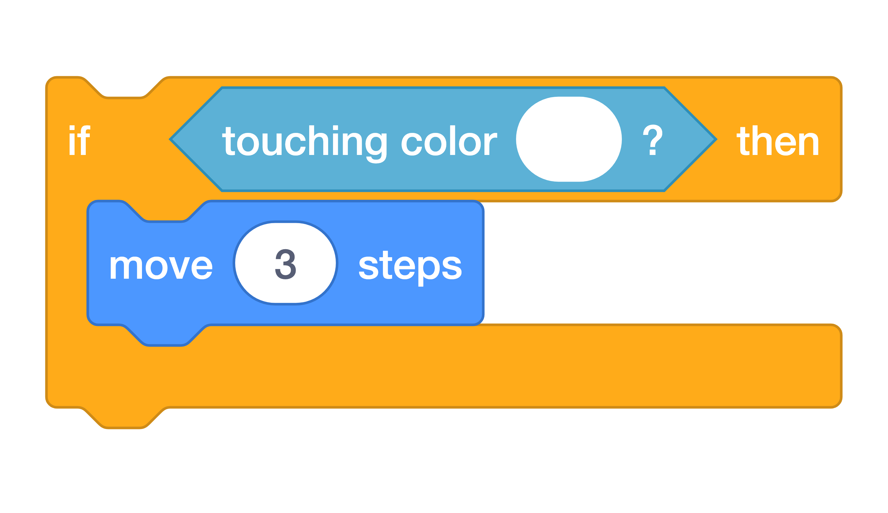

# Add The Speed Boost { .boat-task }

## Goal

Make the boat move three extra steps when it touches a booster.

## Do This

1. Select the boat and find its existing `forever` loop.
2. Add the `if then` block shown below at the bottom of that loop, outside the other conditions. Keep the movement, crash, and win conditions.
3. Use `touching color` and the [eyedropper](../scratch-help.md#choose-a-colour-from-the-stage) to select white from an arrow.
4. Put `move 3 steps` inside this condition.
5. Press the green flag and steer across an arrow, then back onto the water.

{ .scratch-image }

## Check

The boat moves faster while touching white and returns to its usual speed on the water.
