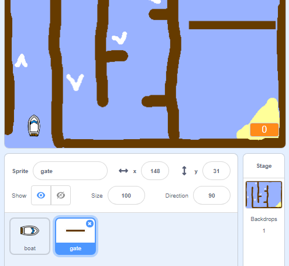
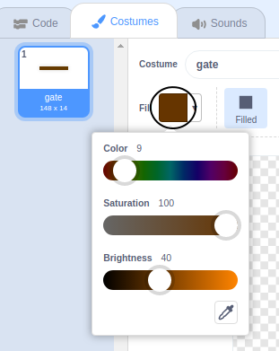
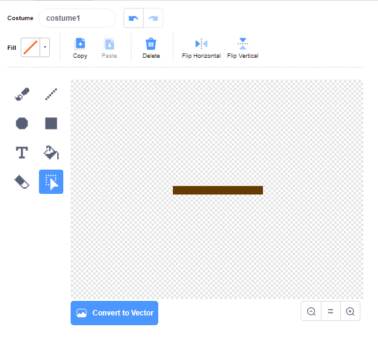

# Draw A Gate { .boat-task }

## Goal

Create a wooden gate for the boat to avoid.

## Do This

1. Open **Choose a Sprite**, select **Paint**, and rename the new sprite `gate`.
2. Draw a long, narrow rectangle in the same brown as the wooden barriers. Use colour `9`, saturation `100`, and brightness `40` to match the starter course.
3. Position the costume so the centre marker is in the middle of the rectangle. This is the point it will rotate around.
4. Place the gate across part of the water. Resize it if necessary, leaving enough room for the boat to get past.

{ .example-image }

{ .example-image }

{ .example-image }

## Check

A sprite called `gate` appears on the course. Its costume is centred and matches the wooden barriers.
