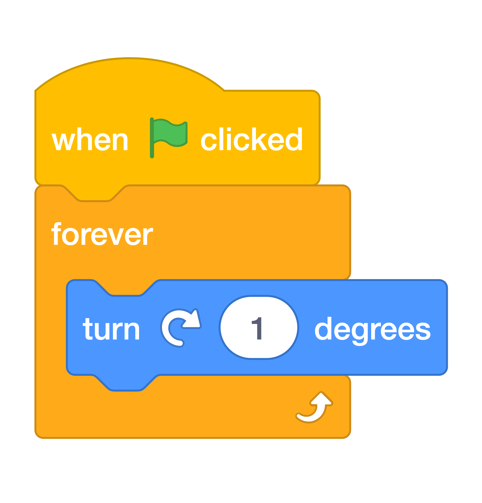

# Spin The Gate { .boat-task }

## Goal

Make the wooden gate turn continuously during the race.

## Do This

1. Select `gate` in the sprite list and click **Code**.
2. Build the script in the image: `when green flag clicked`, then `forever` containing `turn 1 degrees`.
3. Press the green flag. Check that the gate turns around its centre.
4. Steer the boat into the gate. Your existing brown colour check should trigger a crash.
5. Sail past the gate to the island and check that the gate stops when the game ends.

{ .scratch-image }

{ .example-image }

## Check

The gate spins during play, touching it causes a crash, and winning stops it. If contact does not cause a crash, check that its brown matches the barriers.
