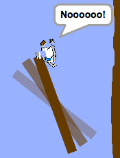

# Check Your Finished Game { .boat-task }

## Goal

Test the complete game and explain how your code works.

## Do This

1. Press the green flag and check the boat’s position, normal costume, and timer reset.
2. Follow the mouse across water and stop near the pointer.
3. Touch a barrier and then the gate. Both should cause a crash and reset the boat.
4. Cross a booster and check that the boat speeds up.
5. Reach the island. After the winning message, the boat, timer, and gate should stop.
6. Restart and complete another race. Save your project.
7. Explain one loop, one condition, and the `time` variable to a partner. Describe one problem you found and how you fixed it.

{ .example-image }

## Check

Every feature works together. You can demonstrate your game, explain its code, and describe an improvement made after testing.
