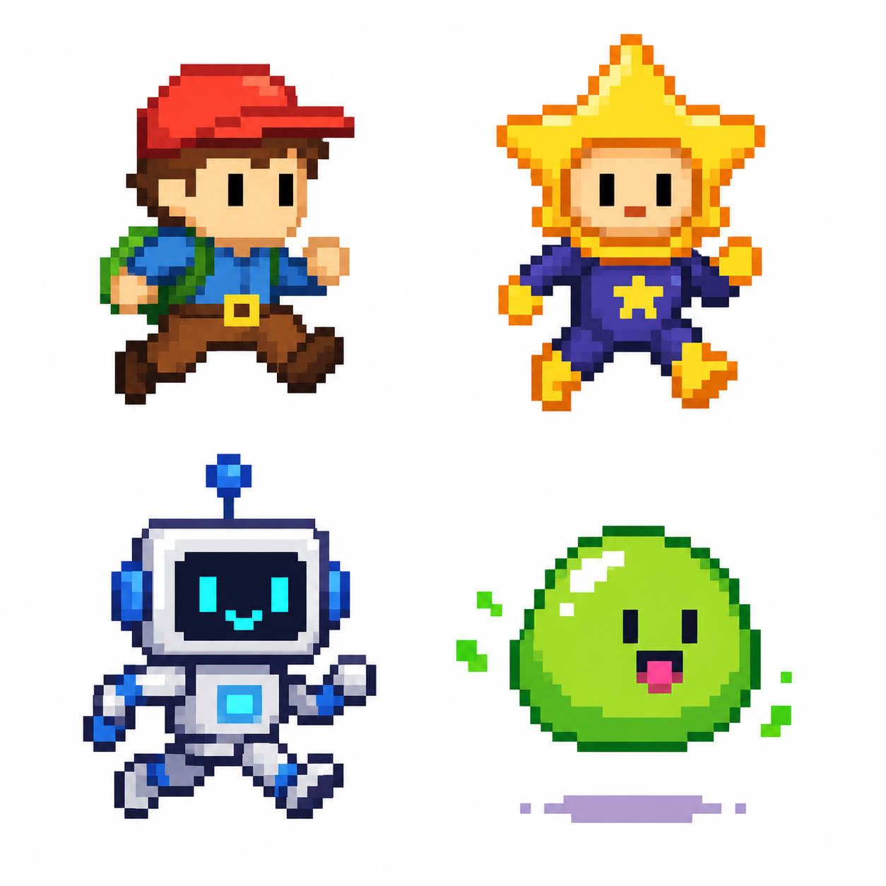
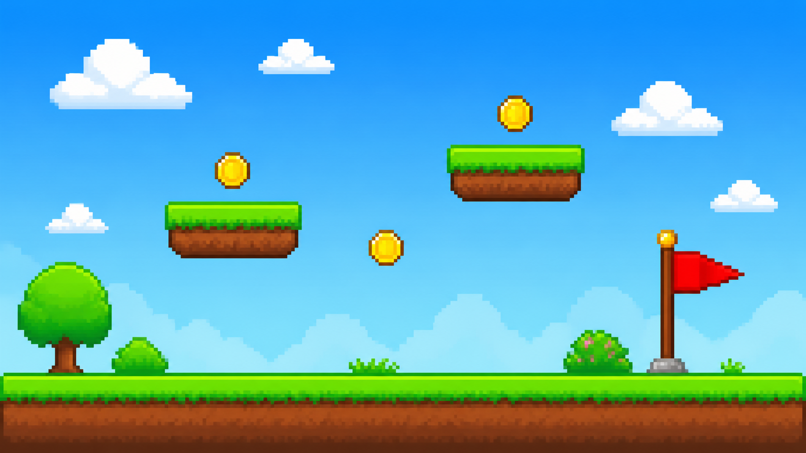
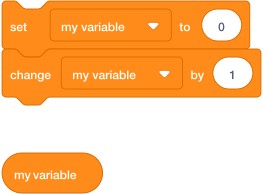
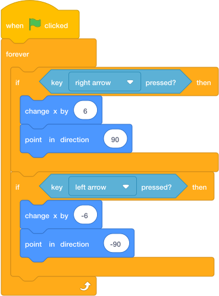

# Lesson 1: Hero Controls

## Mission

Make a hero who can run left, run right, jump, and land on platforms. This is the part that makes the game feel like an arcade platformer.

Goal: by the end of this lesson, your player should move smoothly and jump only when standing on the ground.

## Build Tasks

1. Choose or draw a hero sprite. Rename it `Player`.

    Your hero should be simple enough to redraw in Scratch. Good choices have a clear shape, a face or feature that shows which way they are facing, and one or two bold colours.

    { .example-image }

    Try a tiny runner with a bright hat, a star explorer, a friendly robot, a bouncing blob, or invent your own.

2. Draw a backdrop with a clear ground color. Use one solid color for platforms, such as green.

    The backdrop should make the game easy to read. Use one clear colour for ground and platforms so your collision code can check that colour.

    { .example-image }

    Helpful ingredients: flat ground along the bottom, floating platforms with the same top colour, coins above safe jumps, a finish flag at the far right, and empty sky space so sprites are easy to see.

3. Create a variable called `y speed` for the player only.

    
    **How to create a variable:** A variable is a named box that stores a number for your game. You will use variables for things like jump speed, score, lives, and time.

    { .scratch-image }

    To create a variable in Scratch:

    1. Click **Variables** in the block menu.
    2. Click **Make a Variable**.
    3. Type the variable name exactly as the lesson shows it.
    4. Choose **For all sprites** when the whole game needs to see it, such as `score`, `lives`, or `time`.
    5. Choose **For this sprite only** when only one sprite needs it, such as the player’s `y speed`.
    6. Click **OK**.

4. Add left and right movement.

    { .scratch-image }

5. Add gravity and jumping.

    { .scratch-image }

6. Test every platform by jumping onto it and trying to walk off it.

## Checkpoint

Press the green flag. Your hero should run both ways, face the correct direction, fall down, and jump from the ground.

## Level-Up Ideas

- Change the speed from `6` to `4` or `8`. Which feels best?
- Add a running costume when an arrow key is pressed.
- Add a jump sound when the space key starts a jump.

## Boss Key

If your hero gets stuck inside the ground, check that the platform color in your code exactly matches the platform color on the backdrop.

