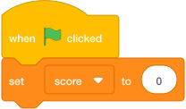
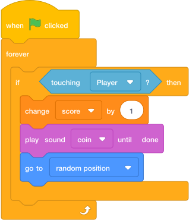

# Lesson 2: Coins And Score

## Mission

Add coins that sparkle, disappear when collected, and increase the score. This turns the level into a treasure hunt.

Goal: by the end of this lesson, the player should be able to collect coins and see the score go up.

## Build Tasks

1. Add a coin sprite. Rename it `Coin`.
2. Create a variable called `score`. Choose **For all sprites**. Use the [variable instructions from Lesson 1](lesson-1-hero-controls.md#how-to-create-a-variable) if you need a reminder.
3. Set `score` to `0` when the green flag is clicked.

    { .scratch-image }

4. Place coins in tricky but fair spots.
5. Make the coin react when it touches the player.

    { .scratch-image }

6. Add a sound so collecting a coin feels satisfying.

## Make It Feel Arcade

Try these small polish tasks:

- Add two costumes to the coin and switch costume inside a forever loop.
- Make the coin glide to a new platform instead of jumping to a random position.
- Create five coin clones at the start of the game.
- Award a bonus when `score` reaches `10`.

## Checkpoint

Collect a coin three times. The score should increase by one each time, and the coin should not get stuck on the player.

## Independent Challenge

Create a special red coin worth `5` points. It should appear only after the player collects `8` normal coins.

## Boss Key

If the score climbs too quickly, add `wait (0.2) seconds` after changing the score, or hide the coin before moving it.

