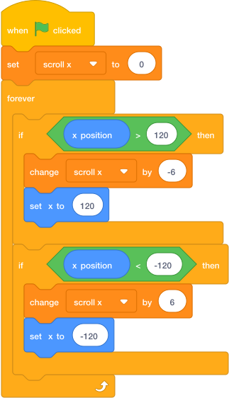

# Lesson 4: Level Finish

## Mission

Add a finish flag, timer, win screen, and optional side-scrolling trick. This final lesson turns the project into a complete mini game.

Goal: by the end of this lesson, the player should be able to start, play, win, lose, and try again.

## Build Tasks

1. Add a flag sprite at the end of the level.
2. Create a variable called `time`. Choose **For all sprites**. Use the [variable instructions from Lesson 1](lesson-1-hero-controls.md#how-to-create-a-variable) if you need a reminder.
3. Set the timer at the start of the game.
4. Make the timer count down while the game is running.
5. Broadcast `you win` when the player touches the flag.
6. Broadcast `game over` when time reaches `0`.

    { .scratch-image }

    Use this on the player or the stage. If you put it on the stage, change the flag check to a message from the player when the player touches the flag.

7. Add a title screen or a simple start button.
8. Add a win screen with the final score.

## Optional Challenge: Side-Scrolling Camera

This script keeps the player near the middle of the screen and changes a `scroll x` variable. Create a variable called `scroll x` and choose **For all sprites**. Use the [variable instructions from Lesson 1](lesson-1-hero-controls.md#how-to-create-a-variable) if you need a reminder. Use this only if you are ready for a harder challenge. Sprites in the level can use `set x to ((start x) + (scroll x))` to move with the camera.

{ .scratch-image }

## Finish Screen Ideas

- Show `You Win!` when the player touches the flag.
- Show `Game Over` when `lives` is `0` or `time` is `0`.
- Play a short victory sound.
- Hide enemies and coins after the game ends.
- Ask the player to press the green flag to try again.

## Checkpoint

Play from the start without stopping. The game should have a clear beginning, a fair challenge, and a clear ending.

## Final Arcade Test

Give your game to someone else for two minutes. Watch quietly and write down:

- Where they got stuck.
- Which jump felt unfair.
- Whether they understood the goal.
- Whether they wanted one more try.

Use that feedback to adjust enemy speed, platform distance, coin placement, and timer length.

## Boss Key

If your game feels too hard, do not remove all the danger. Make the first enemy slower, add a safe platform before the hardest jump, or place coins along the best path.

