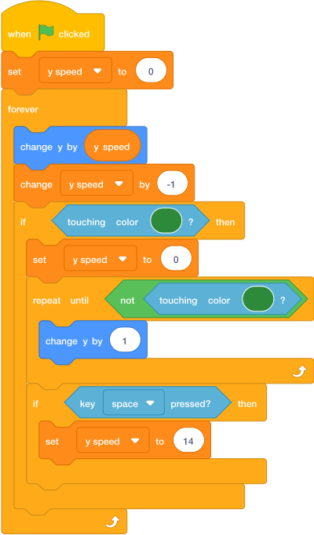

# Task 5: Jump And Fall

## Goal

Make the player jump and fall back down.

## Do This

1. [In the sprite list below the Stage](../index.md#where-to-click-sprites), click the `Player` sprite.
2. Build this code.
3. Use the same green colour as your ground.
4. Press the green flag.
5. Press **space** to jump.

{ .scratch-image }

## Check

The player should jump, fall, and stop on the green ground.
