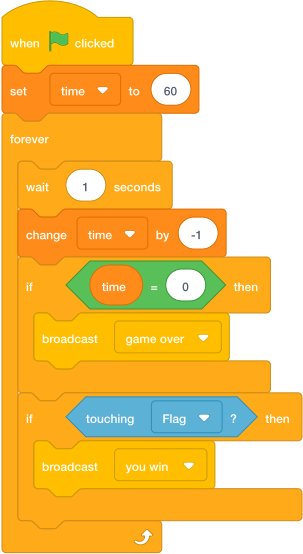

# Task 23: Count Down

## Goal

Make the timer count down.

## Do This

1. [In the sprite list below the Stage](../index.md#where-to-click-sprites), click the `Player` sprite, or click the Stage thumbnail.
2. Build the timer part of this code.
3. Press the green flag.
4. Watch the `time` variable.

{ .scratch-image }

## Check

The timer should go down by `1` every second.
